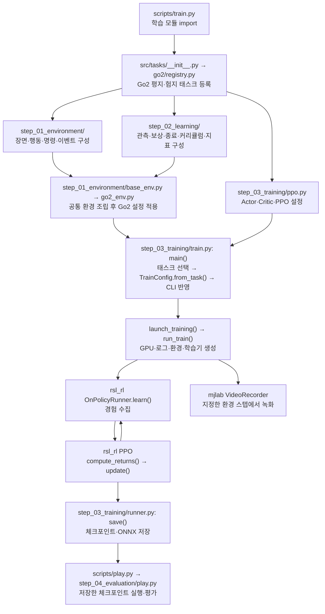
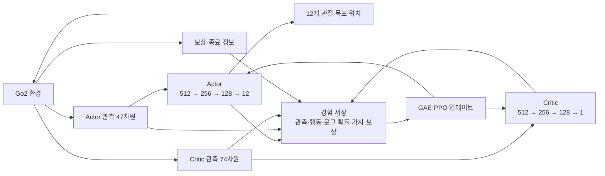

# Go2 학습 파이프라인과 학습 구조 설계

Go2가 목표 속도를 따라 걷도록 학습하는 코드의 구조와 실행 방법을 정리한다. 지원 태스크는 `Unitree-Go2-Flat`과 `Unitree-Go2-Rough`이며, 별도 표시가 없는 설명과 명령은 Flat 기준이다. 리팩토링은 기존 Go2의 관측·행동·보상·PPO 설정을 유지하면서 파일을 학습 구성 순서로 나눈 것이다.

문서는 **폴더 구성 → 정책·환경 설계 → 실제 학습 반복 → 실행 명령 → 저장·검증 → 수정 위치** 순서로 읽는다. 모든 명령은 프로젝트 루트에서 해당 Python 환경을 활성화한 뒤 실행한다. 아래 설정값은 소스의 기본값이며, 실제 실행에 사용한 값은 각 로그 폴더의 `params/agent.yaml`, `params/env.yaml`에서 확인한다.

## 1. 폴더 순서로 보는 학습 구성

```text
src/tasks/go2/
├── registry.py                  Go2 평지·험지 태스크 등록
├── step_01_environment/         ① 로봇이 움직일 환경 구성
│   ├── scene.py                 험지 지형 스캔 센서
│   ├── actions.py               관절 행동 설정
│   ├── commands.py              목표 속도 명령
│   ├── events.py                초기화·랜덤화·외란
│   ├── base_env.py              지형·물리·뷰어 기본값과 단계별 설정 조립
│   └── go2_env.py               Go2 모델·센서·보행 및 평지·험지 차이
├── step_02_learning/            ② 정책에 줄 정보와 학습 목표 구성
│   ├── observations.py          Actor·Critic 관측
│   ├── rewards.py               보상 항목과 가중치
│   ├── terminations.py          에피소드 종료 조건
│   ├── curriculum.py            학습 진행에 따른 난이도
│   ├── metrics.py               기록할 지표
│   └── mdp/                    관측·보상·커리큘럼 등의 실제 계산 함수
├── step_03_training/            ③ 경험 수집·PPO 학습·모델 저장
│   ├── ppo.py                   신경망·PPO·반복·저장 기본값
│   ├── runner.py                체크포인트와 ONNX 저장
│   └── train.py                 CLI 처리·GPU·로그·환경·학습기 생성
└── step_04_evaluation/          ④ 학습한 정책 실행·평가
    └── play.py                  체크포인트 로드·시각화
```

폴더 번호는 코드를 읽고 설정하는 순서다. 학습 중에는 **관측 → 정책·행동 → 물리 시뮬레이션 → 보상·종료·다음 관측**을 반복하고, 경험을 모은 뒤 PPO로 가중치를 업데이트한다. 매 환경 스텝마다 01~04 폴더를 순차 실행한다는 의미는 아니다.

로봇 모델과 제어 상수는 `src/assets/robots/unitree_go2/`에 있다. 실행 명령은 기존처럼 `python scripts/train.py ...`, `python scripts/play.py ...`를 사용한다. 두 스크립트는 각각 03단계와 04단계의 `main()`을 호출하는 진입점이다.

### 구조를 이렇게 나눈 이유

| 구분 | 이 단계에서 결정하는 것 | 다음 단계에 전달하는 것 |
|---|---|---|
| 로봇 에셋 | Go2의 몸체·관절·충돌 형상, 초기 자세, 제어 이득 | 로봇 모델과 제어 설정 |
| 01 환경 | 어떤 지형에서 어떤 명령·외란을 받으며 움직이는가 | 시뮬레이션·행동·명령·이벤트 설정 |
| 02 학습 목표 | 무엇을 관측하고 어떤 행동을 보상·종료하는가 | Actor·Critic 입력과 보상·종료·난이도 설정 |
| 03 학습 실행 | 어떤 신경망과 PPO 설정으로 경험을 모으고 갱신하는가 | 체크포인트, ONNX 정책, 지표, 실행 설정 |
| 04 평가 | 저장한 정책이 시뮬레이션에서 어떻게 움직이는가 | 정책 실행·시각화 결과 |

`make_*()` 함수는 설정을 만들고, `base_env.py`는 01·02단계의 설정을 하나의 환경 설정으로 조립한다. `go2_env.py`가 Go2와 지형별 차이를 적용하고, `registry.py`가 이를 태스크 이름과 연결한다. 따라서 **환경 조립은 01단계가 02단계 설정을 가져오는 구조**다. 폴더 번호가 모듈 의존 방향을 강제하지는 않는다.

설정과 계산도 나누었다. 예를 들어 `rewards.py`는 보상 함수와 가중치를 선택하고, `mdp/rewards.py`는 텐서로 보상을 계산한다. 보행 목표를 조정할 때는 설정 파일부터 보고, 보상 수식 자체를 바꿀 때 계산 함수를 본다. 시뮬레이터 실행은 mjlab, 신경망 최적화는 RSL-RL이 담당한다.

학습용 환경과 실행용 환경은 따로 등록한다. 설정 로더는 등록된 설정을 깊은 복사하여 반환하므로 CLI에서 바꾼 값이 등록 기본값을 덮어쓰지 않는다. `scripts/`는 명령 진입점을 유지하고, 실행 구현은 단계 폴더에 둔다.

### 학습 전체 흐름도

아래 `step_*` 경로는 `src/tasks/go2/` 기준이다.



태스크 등록 과정에서는 설정 객체만 만든다. `main()`에서 태스크를 고르고 `TrainConfig.from_task()`로 설정을 불러온 뒤 CLI 옵션을 반영한다. 실제 시뮬레이션과 신경망은 `run_train()`에서 생성한다.

### 학습 실행 시 만들어지는 객체

```text
최종 환경 설정 → ManagerBasedRlEnv
                  → VideoRecorder       --video True일 때만 추가
                  → RslRlVecEnvWrapper  관측·보상·종료 정보를 RSL-RL 형식으로 변환
최종 PPO 설정 ────────────────────────┐
래핑한 환경 ──────────────────────────┴→ VelocityOnPolicyRunner
                                         → learn() → save()
```

`launch_training()`은 GPU와 실행 폴더를 결정한다. `run_train()`은 시드 설정, 위 객체 생성, 요청된 체크포인트 복원, `params/*.yaml` 기록, `learn()` 호출, 환경 종료를 맡는다. 기본 명령은 새 학습이며, 체크포인트 복원은 resume 옵션을 지정했을 때만 수행한다.

### 파일별 역할과 링크

| 파일 | 역할 |
|---|---|
| [scripts/train.py](scripts/train.py), [scripts/play.py](scripts/play.py) | 기존 CLI 명령을 유지하는 진입점 |
| [src/tasks/__init__.py](src/tasks/__init__.py) | Go2 태스크 등록 모듈 import |
| [registry.py](src/tasks/go2/registry.py) | 태스크 이름과 환경·PPO 설정·Runner 연결 |
| [scene.py](src/tasks/go2/step_01_environment/scene.py), [actions.py](src/tasks/go2/step_01_environment/actions.py), [commands.py](src/tasks/go2/step_01_environment/commands.py), [events.py](src/tasks/go2/step_01_environment/events.py) | 환경 구성 요소별 기본값 |
| [base_env.py](src/tasks/go2/step_01_environment/base_env.py) | 01·02단계 구성 요소를 환경 설정으로 조립 |
| [go2_env.py](src/tasks/go2/step_01_environment/go2_env.py) | Go2 전용 보행·자세·센서와 평지·험지 설정 |
| [observations.py](src/tasks/go2/step_02_learning/observations.py), [rewards.py](src/tasks/go2/step_02_learning/rewards.py) | 관측·보상 설정 |
| [terminations.py](src/tasks/go2/step_02_learning/terminations.py), [curriculum.py](src/tasks/go2/step_02_learning/curriculum.py), [metrics.py](src/tasks/go2/step_02_learning/metrics.py) | 종료·커리큘럼·지표 설정 |
| [mdp/observations.py](src/tasks/go2/step_02_learning/mdp/observations.py), [mdp/rewards.py](src/tasks/go2/step_02_learning/mdp/rewards.py), [mdp/curriculums.py](src/tasks/go2/step_02_learning/mdp/curriculums.py) | 설정에서 참조하는 실제 관측·보상·커리큘럼 계산 |
| [ppo.py](src/tasks/go2/step_03_training/ppo.py) | 신경망 구조, PPO 파라미터, 반복·저장 기본값 |
| [train.py](src/tasks/go2/step_03_training/train.py) | 인자 해석, GPU·로그 설정, 환경·학습기 생성, 학습 시작 |
| [runner.py](src/tasks/go2/step_03_training/runner.py) | 체크포인트 저장 시 ONNX도 내보내는 Runner |
| [play.py](src/tasks/go2/step_04_evaluation/play.py) | 학습된 체크포인트 실행·시각화 |
| [go2_constants.py](src/assets/robots/unitree_go2/go2_constants.py) | 로봇 모델 로드, 기본 관절 자세, 제어 이득·토크 제한 |
| [go2.xml](src/assets/robots/unitree_go2/xmls/go2.xml) | 몸체·관절·충돌 형상 등 물리 모델 |

### 설정 적용 순서

```text
step_01_environment/ 각 구성 + step_02_learning/ 각 구성
  → base_env.py: make_velocity_env_cfg()       공통 환경 조립
  → go2_env.py: unitree_go2_rough_env_cfg()    Go2 전용 설정 적용
  → go2_env.py: unitree_go2_flat_env_cfg()     평지 태스크일 때 지형 스캔 제거
  → step_03_training/train.py: TrainConfig.from_task()
  → CLI 옵션                                 이번 실행의 값으로 덮어쓰기
```

공통 설정과 `step_01_environment/go2_env.py`는 Go2 평지·험지 태스크에서 함께 사용한다. Go2 평지만 바꾸려면 `unitree_go2_flat_env_cfg()`에서 값을 덮어쓴다. `if play:` 내부는 실행 모드 전용이므로 학습에 적용할 설정은 그 밖에 둔다.

### 라이브러리에서 실행되는 부분

다음 경로는 저장소 내부가 아니라 설치된 Python 패키지 기준이다.

| 패키지 내부 경로 | 주요 역할 |
|---|---|
| `mjlab/tasks/registry.py` | 태스크 등록 및 환경·학습 설정 로드 |
| `mjlab/envs/manager_based_rl_env.py` | `ManagerBasedRlEnv.step()`으로 행동 적용·시뮬레이션·보상·관측 계산 |
| `mjlab/rl/vecenv_wrapper.py` | 환경을 RSL-RL 인터페이스에 연결 |
| `mjlab/rl/runner.py` | `MjlabOnPolicyRunner`: 학습기와 mjlab 저장·내보내기 기능 연결 |
| `rsl_rl/runners/on_policy_runner.py` | `learn()`에서 경험 수집·업데이트·로그·모델 저장 반복 |
| `rsl_rl/algorithms/ppo.py` | PPO 손실 계산, 역전파, 옵티마이저 업데이트 |
| `mjlab/utils/wrappers/video_recorder.py` | 지정한 스텝에서 프레임을 모아 영상 저장 |

패키지 경로는 활성화한 Python 환경의 `site-packages/` 아래이며 설치 환경마다 다르다. Runner 상속 관계는 `VelocityOnPolicyRunner → MjlabOnPolicyRunner → OnPolicyRunner`이며, 실제 학습 반복문은 마지막 클래스의 `learn()`을 사용한다.

## 2. 학습을 위해 설계된 정책과 환경

정책(Actor)은 관측값으로부터 행동을 결정하는 신경망이다. 현재 목표는 평지에서 명령 속도를 따라가면서 자세를 유지하고 대각선 다리 쌍을 번갈아 사용하는 보행을 학습하는 것이다. Critic은 학습 중 상태의 가치를 추정한다.

사람이 관측·행동·보상·환경·학습 방법을 설정하고, 학습을 통해 신경망 가중치를 얻는다. 참조 보행 영상을 입력하는 모방학습이 아니며, 녹화 영상도 학습 입력으로 쓰이지 않는다.

### 정책 입력과 출력

| Actor 입력 | 차원 | 의미 |
|---|---:|---|
| 몸체 각속도 | 3 | 몸체 회전 속도 |
| 몸체 기준 중력 방향 | 3 | 몸체 기울기 |
| 속도 명령 | 3 | 전후·좌우 이동 및 회전 목표 |
| 보행 위상 | 2 | 주기의 위치를 sin/cos로 표현 |
| 관절 위치 | 12 | 기본 관절 자세 대비 위치 |
| 관절 속도 | 12 | 관절 움직임 |
| 이전 행동 | 12 | 직전 정책 출력 |
| **합계** | **47** | Go2 평지 Actor 입력 |

표 순서는 관측 벡터를 연결하는 순서다. Actor는 일부 관측에 노이즈를 적용하고, `history_length=1`로 과거 스텝을 추가로 쌓지 않는다. 평지 환경에는 지형 스캔과 카메라 영상 입력이 없다.

Critic은 Actor와 같은 종류의 47차원 관측에 다음 정보를 더한 **74차원**을 입력받는다. Critic 관측에는 노이즈를 적용하지 않으므로 Actor에게 전달된 벡터를 그대로 재사용하는 것은 아니다.

| Critic에 추가되는 입력 | 차원 |
|---|---:|
| 몸체 선속도 | 3 |
| 네 발의 높이 | 4 |
| 네 발의 공중 체류 시간 | 4 |
| 네 발의 접촉 여부 | 4 |
| 네 발의 접촉력, 발당 xyz를 `sign(F) × log1p(abs(F))`로 압축 | 12 |
| **추가 합계 / 전체 합계** | **27 / 74** |

Actor는 행동을 선택하고 Critic은 상태 가치를 추정하도록 입력을 나눈 구조다. 학습 중에는 둘 다 사용하고, 정책 추론에는 Actor와 그 관측 정규화를 사용한다.



```text
47개 관측
  → Actor 은닉층 512 → 256 → 128 (ELU)
  → 12개 관절 행동
  → 처리된 목표 위치 = 기본 관절 위치 + 0.25 × 행동
  → 실제 제어 목표 = 처리된 목표 위치 − encoder_bias
  → 관절 위치 제어기(PD)
  → 물리 시뮬레이션
```

Critic도 은닉층 `(512, 256, 128)`과 ELU를 사용하며 최종 출력은 상태 가치 1개다. Actor와 Critic 모두 관측 정규화를 사용한다. Actor는 학습 중 가우시안 행동 분포를 사용하며 초기 표준편차는 각 행동 차원에서 `1.0`이다. 저장된 정책을 실행할 때는 분포의 평균 행동을 사용한다.

12개 출력은 직접 토크가 아니라 기본 자세에 대한 관절 위치 변화량이다. `encoder_bias`는 환경 시작 시 관절마다 `±0.015rad` 범위에서 정해지는 편향이다. 엉덩이·허벅지 관절의 강성/감쇠는 `20/1`, 종아리는 `40/2`이며 토크 제한은 각각 `23.5`, `45Nm`다. 이 값은 로봇 에셋의 `go2_constants.py`에서 정한다.

현재 모델의 관절 행동 순서는 **FL → FR → RL → RR**, 각 다리 안에서는 **hip → thigh → calf**다. 기본 자세는 왼쪽 hip `−0.1rad`, 오른쪽 hip `+0.1rad`, thigh `0.9rad`, calf `−1.8rad`다. ONNX 메타데이터에도 관절 이름과 제어 설정이 기록된다.

물리 시뮬레이션 간격은 `0.005초`, `decimation=4`이므로 정책은 `0.02초`마다, 즉 **50Hz**로 행동을 정한다.

### 평지와 험지의 차이

| 구분 | `Unitree-Go2-Flat` | `Unitree-Go2-Rough` |
|---|---|---|
| 지형 | 평면 | 생성된 험지 |
| 지형 스캔 | 제거 | `1.6 × 1.0m`, 간격 `0.1m`, `17 × 11 = 187`개 |
| Actor 입력 | 47 | 234 = 47 + 187 |
| Critic 입력 | 74 | 261 = 74 + 187 |
| 지형 난이도 커리큘럼 | 제거 | 활성화 |
| 속도 명령 커리큘럼 | 활성화 | 활성화 |
| 행동·신경망 은닉층·PPO | 12개 행동, 공통 설정 | 12개 행동, 공통 설정 |

위 표는 학습 설정 기준이다. Rough 관측에서 지형 스캔은 Actor 공통 47개 항목 다음에 오며, Critic에서도 몸체 선속도보다 앞에 온다. 입력 차원이 다르므로 Flat 체크포인트를 Rough에 그대로 적용할 수 없다.

### 보행과 자세 기준

- 보행 주기: `0.6초`.
- 발 위상 오프셋: `[0.0, 0.5, 0.5, 0.0]`. 대각선 다리 쌍을 같은 위상으로 움직이는 트로트 보행을 유도한다.
- 접지 기준: 주기의 `56%` 구간에서 발이 지면과 접촉하도록 보상한다.
- 발 높이 목표: `0.10m`. 발의 수평 속도로 가중한 높이 오차에 비용을 부과한다. 현재 구현은 월드 좌표의 발 높이 `z`를 사용하므로, 특히 Rough에서 지형면 기준으로 발을 10cm 들어 올리는 목표와는 다르다. 발 궤적을 강제로 고정하지는 않는다.
- 기본 자세 허용 범위: 정지 시 좁고 이동 시 넓다. Go2의 보행·달리기 자세 허용 범위는 현재 같은 값이다.

### 보상 설계

보상 항목과 가중치는 `step_02_learning/rewards.py`, Go2 전용 덮어쓰기는 `step_01_environment/go2_env.py`, 실제 계산식은 `step_02_learning/mdp/rewards.py` 및 가져온 mjlab 함수에서 확인한다. 여기서 `step_*` 경로는 모두 `src/tasks/go2/` 기준이다.

| 항목 | weight | 유도하는 행동 |
|---|---:|---|
| `track_linear_velocity` | `1.0` | 목표 선속도 추종 및 수직 흔들림 억제 |
| `track_angular_velocity` | `1.0` | 목표 회전 속도 추종 |
| `body_orientation_l2` | `-1.0` | 몸체 기울어짐 억제 |
| `pose` | `1.0` | 명령 속도에 따른 허용 범위 안에서 기본 자세 유지 |
| `body_ang_vel` | `-0.05` | 몸체 롤·피치 회전 억제 |
| `angular_momentum` | `-0.025` | 전체 각운동량 억제 |
| `is_terminated` | `-200.0` | 실패 종료 페널티 |
| `joint_acc_l2` | `-2.5e-7` | 관절 가속도 억제 |
| `joint_pos_limits` | `-10.0` | 관절 위치 한계 위반 억제 |
| `action_rate_l2` | `-0.05` | 급격한 행동 변화 억제 |
| `foot_gait` | `0.5` | 발 접촉 타이밍 맞추기 |
| `foot_clearance` | `-1.0` | 이동하는 발의 목표 높이 오차 억제 |
| `foot_slip` | `-0.25` | 지면에 닿은 발의 미끄러짐 억제 |
| `soft_landing` | `-0.001` | 착지 충격 억제 |
| `stand_still` | `-1.0` | 정지 명령일 때 기본 자세에서 벗어나는 것 억제 |

기본값은 `scale_rewards_by_dt=True`다. 따라서 한 정책 스텝의 보상은 `0.02 × Σ(weight × 보상 함수 출력)`이다. 예를 들어 실패 종료 항목의 가중치 `-200`은 해당 스텝에서 `-4`로 반영되고, 시간 제한만으로 종료할 때는 이 실패 항목을 부과하지 않는다. 다른 보상 항목은 별도로 합산된다.

실제 영향은 함수 출력 크기와 가중치가 함께 결정한다. 가중치의 절댓값만 비교해서 중요도를 판단하지 않는다. 여러 항목이 동시에 작용하므로 특정 항목 변경이 원하는 동작을 보장하지는 않는다.

### 속도 명령·환경·종료 조건

- `commands["twist"]`는 전후·좌우·회전 명령을 만들며, `3~8초`마다 다시 뽑는다. 정지 명령 환경 비율은 `5%`로 설정되어 있다. 목표 방향을 이용하는 heading 제어도 켜져 있다.
- 명령 커리큘럼 첫 단계 범위: 전후 `(-0.5, 1.0)m/s`, 좌우 `(-0.5, 0.5)m/s`, 회전 `(-1.0, 1.0)rad/s`.
- 커리큘럼은 리셋 시 `common_step_counter > stage["step"]` 조건으로 적용된다. 스텝 0의 최초 리셋은 `commands.py`의 원래 범위를 사용하고, 학습 진행 후 첫 리셋부터 위 첫 단계 범위가 적용된다.
- `120,000 = 5,000 × 24` 환경 스텝을 넘긴 뒤 리셋에서 전후 `(-1.0, 2.0)m/s`, 좌우 `(-1.0, 1.0)m/s`로 범위를 확대한다. 변경한 범위는 이후 명령 재샘플링에 사용한다. 이 기준은 전체 환경의 경험 수가 아니라 환경 스텝 수이며, 수집 스텝 수를 바꾸어도 임계값 `120,000`이 자동으로 바뀌지는 않는다.
- 발 마찰 계수 `0.3~1.6`, 관절 센서 편향, 몸체 무게중심 위치 등을 무작위화한다.
- `5~6초`마다 몸체 속도를 바꾸는 외란을 주어 균형 회복을 학습시킨다.
- 에피소드는 최대 `20초`. 몸체가 `70도` 넘게 기울거나 발 이외 부위의 지면 접촉력이 기준을 넘으면 조기 종료한다.
- 평지 실행 모드(`play=True`)는 관측 노이즈·밀기 외란·커리큘럼을 끄고 속도 범위를 따로 설정하며 시간 제한을 사실상 무한대로 늘린다. 시작 시 마찰·센서 편향·무게중심 랜덤화와 리셋 자세 랜덤화는 유지되므로 무작위성이 완전히 사라지는 것은 아니다.

## 3. 학습 방법: PPO 경험 수집과 업데이트

### 환경 한 스텝과 PPO 한 반복

환경 한 스텝은 `0.02초`를 진행하는 단위이고, PPO 한 반복은 이런 스텝을 기본 `24회` 모은 뒤 신경망을 갱신하는 단위다. 에피소드 종료 시점과 PPO 업데이트 시점은 서로 다르다.

`ManagerBasedRlEnv.step()`은 다음 순서로 동작한다.

1. Actor가 선택한 행동을 관절 목표 위치로 처리한다.
2. 행동 적용과 물리 시뮬레이션을 `4회 × 0.005초` 진행한다.
3. 환경 스텝 수를 증가시키고 종료 조건, 보상, 기록 지표를 계산한다.
4. 종료된 환경만 리셋한다. 커리큘럼도 이 리셋 과정에서 계산한다.
5. 시뮬레이션 상태를 갱신하고 속도 명령과 주기적 외란을 처리한다.
6. 센서를 읽어 다음 관측을 만들고 관측·보상·실패 종료·시간 제한 종료를 반환한다.

`RslRlVecEnvWrapper`는 두 종료 신호를 `dones`로 합치고 시간 제한 정보도 별도로 전달한다. PPO는 시간 제한을 실제 실패와 구분해 가치 추정에 반영한다. 반환된 다음 관측에는 이미 리셋된 환경의 관측이 포함될 수 있다.

한 번의 학습 반복은 다음 순서다.

1. 모든 환경에서 Actor로 행동을 선택한다.
2. 환경이 행동을 적용하고 물리 시뮬레이션을 진행한다.
3. 보상·종료 여부·다음 관측을 계산하고 경험을 저장한다. 종료된 환경은 리셋한다.
4. 환경당 `24스텝`을 모은 뒤 수익과 이점(Advantage)을 계산한다.
5. 수집한 경험을 `4개 미니배치`로 나누고 `5에포크` 동안 PPO로 Actor·Critic을 업데이트한다.
6. 지표를 기록하고 지정한 반복 간격에 모델을 저장한다.

실제 `OnPolicyRunner.learn()`을 단순화하면 다음과 같다.

```python
# 흐름 설명용 의사코드
for iteration in range(max_iterations):
    for step in range(num_steps_per_env):
        actions = alg.act(obs)
        obs, rewards, dones, extras = env.step(actions)
        alg.process_env_step(obs, rewards, dones, extras)

    alg.compute_returns(obs)
    alg.update()
    # 로그 기록, 정해진 간격에 runner.save()
```

`PPO.update()` 안에서 손실을 계산하고 `loss.backward()`와 `optimizer.step()`으로 가중치를 수정한다. 1,024개 환경은 **하나의 정책을 공유**한다.

GAE는 보상과 Critic의 가치 추정으로 선택한 행동이 얼마나 유리했는지를 추정한다. PPO는 이 이점을 이용한 정책 손실, Critic의 가치 오차, 탐색을 위한 엔트로피 항을 결합한다. 정책이 한 번에 너무 크게 바뀌지 않도록 확률비를 클리핑하고, KL에 따라 학습률을 조정한다. 환경에서 경험을 모으는 동안에는 역전파하지 않고, 모은 경험을 업데이트 단계에서 사용한다.

Flat의 환경 수를 `N`이라 하면 관측 배치는 Actor `[N, 47]`, Critic `[N, 74]`, 행동은 `[N, 12]`다. 한 반복에서 `N × 24`개의 경험을 모으고, 기본 설정은 같은 수집 데이터를 `5에포크 × 4미니배치`로 학습한 다음 새 경험을 수집한다. 환경 팩토리의 기본 환경 수는 `1`이므로 본 학습에서는 CLI로 환경 수를 지정한다.

### 환경 수·반복·시드의 차이

| 용어 | 이번 본 학습 예시 | 의미 |
|---|---:|---|
| 환경 수 | `1024` | 동시에 경험을 모으는 독립적인 로봇 환경 수 |
| 학습 반복 | `10001` | 경험 수집과 PPO 업데이트를 반복하는 횟수 |
| 환경당 수집 스텝 | `24` | 한 반복에서 각 환경이 진행하는 스텝 수 |
| 에피소드 | 최대 `20초` | 리셋부터 종료까지의 한 시도 |
| 시드 | 기본 `42` | 무작위 생성의 기준값. 환경 수나 학습 반복 수와 다르다 |

한 반복의 경험은 `1024 × 24 = 24,576개`이다. 새 학습 10,001회의 전체 환경 진행 횟수는 `10001 × 24 = 240,024스텝`이며, 모든 환경의 경험을 합치면 `245,784,576개`이다. 영상 간격은 환경 수를 곱하지 않은 환경 스텝 기준이다.

### PPO와 Runner 기본값

| 항목 | 소스 기본값 | 의미 |
|---|---|---|
| `algorithm.learning_rate` | `0.001` | 초기 학습률 |
| `algorithm.value_loss_coef` | `1.0` | Critic 가치 손실 계수 |
| `algorithm.use_clipped_value_loss` | `True` | 가치 손실 클리핑 사용 |
| `algorithm.schedule` | `adaptive` | 학습률 적응 조정 |
| `algorithm.clip_param` | `0.2` | PPO 정책 갱신 클리핑 범위 |
| `algorithm.entropy_coef` | `0.01` | 탐색을 유도하는 엔트로피 항 계수 |
| `algorithm.gamma` | `0.99` | 미래 보상 할인율 |
| `algorithm.lam` | `0.95` | GAE 이점 추정 계수 |
| `algorithm.desired_kl` | `0.01` | 적응 학습률의 KL 기준 |
| `algorithm.max_grad_norm` | `1.0` | 그래디언트 노름 제한 |
| `algorithm.num_learning_epochs` | `5` | 수집 데이터에 대한 학습 에포크 |
| `algorithm.num_mini_batches` | `4` | 미니배치 수 |
| `num_steps_per_env` | `24` | 환경당 수집 스텝 |
| `max_iterations` | `10001` | 학습 반복 횟수 |
| `save_interval` | `100` | 체크포인트 저장 반복 간격 |
| `experiment_name` | `go2_velocity` | 로그 상위 폴더 이름 |

아래 명령의 `--agent.save-interval 500` 등은 이 기본값을 이번 실행에 한해 덮어쓴다. 기본 로거는 `wandb`이며 이 문서의 학습 명령은 로컬 지표 확인을 위해 `tensorboard`로 지정한다.

## 4. 학습 명령어

줄 끝의 `\`는 Bash에서 명령을 다음 줄로 이어 쓰는 문법이다. 현재 인자 처리 방식은 불리언 값을 명시해야 하므로 영상 옵션은 **`--video True`**로 쓴다. `--video`만 쓰면 값이 없다는 오류가 발생한다.

### 4.1 설치·동작 확인: 8개 환경, 3회

```bash
python scripts/train.py Unitree-Go2-Flat \
  --env.scene.num-envs 8 \
  --agent.max-iterations 3 \
  --agent.num-steps-per-env 8 \
  --agent.save-interval 1 \
  --agent.logger tensorboard \
  --agent.run-name refactor_smoke
```

한 반복에 `8 × 8 = 64개` 경험을 모아 PPO를 업데이트하고, 3회 반복한다. 결과는 `logs/rsl_rl/go2_velocity/<날짜_시간>_refactor_smoke/`에 저장한다. 이 명령은 환경 생성·경험 수집·PPO 업데이트·모델 저장·ONNX 내보내기 흐름의 동작 확인용이다. 보행 성능은 충분히 학습한 정책으로 별도 평가한다.

### 4.2 짧은 영상 테스트: 10개 환경, 100회

```bash
python scripts/train.py Unitree-Go2-Flat \
  --env.scene.num-envs 10 \
  --agent.max-iterations 100 \
  --agent.save-interval 50 \
  --agent.run-name go2_short_video \
  --agent.logger tensorboard \
  --video True \
  --video-interval 500 \
  --video-length 200
```

모델은 50회 학습 반복 간격으로 저장한다. 영상은 500스텝 간격, 회당 200프레임으로 현재 50 FPS에서 약 4초다. 이 명령은 동작 확인용이며 안정적인 보행 학습을 목표로 하는 본 학습과 구분한다.

### 4.3 본 학습: 1,024개 환경, 10,001회, 영상 없음

```bash
python scripts/train.py Unitree-Go2-Flat \
  --env.scene.num-envs 1024 \
  --agent.max-iterations 10001 \
  --agent.run-name go2_flat_baseline \
  --agent.logger tensorboard
```

### 4.4 본 학습 + 1분 영상 5회 저장

```bash
python scripts/train.py Unitree-Go2-Flat \
  --env.scene.num-envs 1024 \
  --agent.max-iterations 10001 \
  --agent.save-interval 500 \
  --agent.run-name go2_flat_baseline_video \
  --agent.logger tensorboard \
  --video True \
  --video-interval 59000 \
  --video-length 3000
```

보행 성능은 학습 지표와 실행 결과를 보고 평가한다. 반복 횟수만으로 보행 품질이 보장되지는 않는다. 위 명령들은 `--agent.resume`을 지정하지 않았으므로 새 학습을 시작한다.

현재 설정에서 계산한 녹화 일정:

- 전체 학습: `10001 × 24 = 240,024` 환경 스텝.
- 영상 FPS: `1 / (0.005 × 4) = 50`.
- 영상 길이: `3000 / 50 = 60초`. 실제 학습에 걸리는 시간과 별개인 영상 재생 시간이다.
- 녹화 시작: `0`, `59,000`, `118,000`, `177,000`, `236,000`스텝.
- 학습 진행률 약 `0%`, `25%`, `49%`, `74%`, `98%`에서 시작한다.
- 마지막 녹화도 학습 종료 전에 3,000프레임을 채우므로, 중단 없이 완료하면 1분 영상 5개가 저장된다.

영상에는 환경 리셋 장면이 포함될 수 있다. 1분 녹화가 로봇이 넘어지지 않고 1분 동안 걸었다는 의미는 아니다. 학습 반복·환경당 수집 스텝·물리 시간 간격을 바꾸면 녹화 간격과 길이를 다시 계산한다.

### 주요 인자 설명

| 인자 | 의미와 단위 |
|---|---|
| `Unitree-Go2-Flat` | Go2 평지 속도 추종 태스크 선택 |
| `--env.scene.num-envs` | 병렬 시뮬레이션 환경 수 |
| `--agent.max-iterations` | 학습 반복 횟수, 에피소드 수나 시드 수가 아님 |
| `--agent.num-steps-per-env` | 매 PPO 업데이트 전 환경당 수집할 스텝 수 |
| `--agent.save-interval` | 모델 저장 간격, 학습 반복 기준 |
| `--agent.run-name` | 실행 폴더 이름 뒤에 붙는 실험 이름 |
| `--agent.logger tensorboard` | 보상·손실 등 학습 지표를 TensorBoard 형식으로 기록 |
| `--video True` | 학습 영상 녹화 활성화 |
| `--video-interval` | 녹화 시작 간격, 환경 스텝 기준 |
| `--video-length` | 영상당 프레임 수, 초 단위가 아님 |

## 5. 학습 결과 저장과 확인

```text
logs/rsl_rl/go2_velocity/<날짜_시간>_<run_name>/
├── model_<반복번호>.pt   학습 체크포인트: 모델 가중치·학습 상태
├── policy.onnx          Actor·관측 정규화·메타데이터를 포함한 추론용 정책
├── events.out.tfevents.* TensorBoard 지표(--agent.logger tensorboard)
├── git/                 실행 코드 변경 기록
├── params/
│   ├── agent.yaml       실제 신경망·PPO·Runner 설정
│   └── env.yaml         실제 환경·보상·관측 설정
└── videos/train/
    └── rl-video-step-<스텝>.mp4
```

반복 번호는 0부터 시작한다. 현재 Runner는 지정한 간격 외에도 학습 종료 시 최종 모델을 저장한다. 새 학습을 10,001회 완료하면 최종 반복 번호는 `10000`이다.

`VelocityOnPolicyRunner.save()`는 체크포인트 저장 시 `policy.onnx`도 내보낸다. `.pt`에는 Actor·Critic 및 옵티마이저 등의 학습 상태가 들어가고, ONNX에는 추론에 필요한 Actor와 관측 정규화가 들어간다. ONNX 파일명은 고정이므로 같은 실행 폴더에서 다음 저장 시 갱신된다. 특정 반복의 ONNX를 보관하려면 다음 저장 전에 별도 이름으로 복사한다.

체크포인트·영상 목록 확인:

```bash
find logs/rsl_rl/go2_velocity -name 'model_*.pt' | sort -V
find logs/rsl_rl/go2_velocity -name '*.mp4' | sort -V
```

TensorBoard 실행 후 브라우저에서 표시된 주소(기본 `http://localhost:6006`)로 접속한다.

```bash
tensorboard --logdir logs/rsl_rl/go2_velocity
```

### 리팩토링 후 검증 기록: 2026-09-30

[리팩토링 커밋 `1bda1fd`](https://github.com/kante2/unitree_rl_mjlab/commit/1bda1fd0490415fe36b273066896def21a2ed95e)에 해당하는 코드로 4.1절의 설정을 사용해 Flat의 짧은 GPU 학습을 실행한 기록이다.

| 항목 | 확인한 결과 |
|---|---|
| 태스크·장치·시드 | `Unitree-Go2-Flat`, `cuda:0`, `42` |
| 환경·수집·반복 | 환경 8개 × 환경당 8스텝 × 3회 = 경험 192개 |
| 입력·출력 | Actor 47, Critic 74, 행동 12 |
| 학습 결과 | 3회 PPO 업데이트 완료, 체크포인트 간 정책 가중치 변경 확인 |
| 수치 검사 | 저장된 모델 가중치와 TensorBoard 스칼라 36종에 NaN/Inf 없음 |
| 저장 | `model_0.pt`, `model_1.pt`, `model_2.pt`, `policy.onnx`, 설정 YAML 생성 |
| ONNX | 모델 검사 통과, 입력 `[1, 47]`, 출력 `[1, 12]` |
| 리팩토링 전후 비교 | Flat·Rough의 학습/실행 설정, 관측 순서, PPO 설정 일치 |
| CLI·패키징 | Go2 태스크 목록과 CLI 확인, wheel 설치본의 import 및 Go2 모델 컴파일 통과 |

검증 환경은 Python `3.11.15`, PyTorch `2.7.0+cu128`, mjlab `1.2.0`, MuJoCo `3.5.0`, mujoco-warp `3.5.0`, warp-lang `1.12.0`, rsl-rl-lib `5.0.1`이다. 프로젝트의 설치 안내는 [README.md](README.md)를 따른다. 이 버전 목록은 검증한 조합을 기록한 것이며, 모든 항목이 `setup.py`에 고정되어 있다는 뜻은 아니다.

실제 로컬 결과 경로:

```text
logs/rsl_rl/go2_velocity/2026-09-30_18-51-15_refactor_smoke/
├── model_0.pt
├── model_1.pt
├── model_2.pt
├── policy.onnx
├── events.out.tfevents.*
├── git/
└── params/
    ├── agent.yaml
    └── env.yaml
```

`logs/`는 Git에서 제외되어 원격 저장소에는 포함되지 않는다. 새로 실행하면 다른 날짜·시간의 폴더가 만들어진다. 실제 학습 검증은 Flat에 대해 수행했으며, 이 3회 실행은 파이프라인의 동작을 확인하는 범위다. 충분히 학습된 보행 성능이나 Rough의 실제 학습 완료를 의미하지 않는다.

### 학습한 모델을 MuJoCo 창으로 실행

위 동작 확인용 체크포인트 실행(보행이 완성된 모델은 아님):

```bash
python scripts/play.py Unitree-Go2-Flat \
  --checkpoint-file "logs/rsl_rl/go2_velocity/2026-09-30_18-51-15_refactor_smoke/model_2.pt" \
  --num-envs 1 \
  --device cuda:0 \
  --viewer native
```

본 학습 결과를 볼 때는 `--checkpoint-file`을 해당 실행 폴더의 모델 경로로 바꾼다. `play.py`는 실행용 환경 설정으로 환경을 만들고 체크포인트에서 Actor를 불러와 추론한다. PPO 업데이트는 하지 않는다. `--viewer native`는 화면을 표시할 수 있는 데스크톱 세션에서 사용한다.

현재 `step_03_training/train.py`는 실시간 MuJoCo 창을 띄우지 않는다. `--video True`도 영상 파일 저장 기능이다. 학습 중 별도 터미널에서 `play.py`를 실행할 수는 있지만, 불러온 체크포인트의 동작을 보여주며 학습 중 가중치가 자동으로 갱신되지는 않는다.

## 6. 정책 설계를 바꿀 때 볼 곳

| 바꾸려는 내용 | 우선 확인할 파일·설정 |
|---|---|
| 지형·물리 스텝·환경 구성 | `step_01_environment/base_env.py`, `go2_env.py` |
| 지형 스캔 센서 | `step_01_environment/scene.py` |
| 명령 속도 범위·난이도 | `step_01_environment/commands.py`, `step_02_learning/curriculum.py` |
| Go2 보행 주기·발 타이밍·자세 | `step_01_environment/go2_env.py`, `step_02_learning/observations.py`의 `phase`, `rewards.py`의 `foot_gait` |
| 안정성·미끄러짐·발 높이 | `step_02_learning/rewards.py`, `step_02_learning/mdp/rewards.py` |
| 정책에 제공할 센서 정보 | `step_02_learning/observations.py`, `step_02_learning/mdp/observations.py` |
| 관절 행동 크기·제어 특성 | `step_01_environment/actions.py`, `go2_env.py`, 로봇 에셋의 `go2_constants.py` |
| 신경망 크기·학습률·PPO | `step_03_training/ppo.py` |
| 랜덤화·외란 | `step_01_environment/events.py` |
| 실패·시간 제한 종료 조건 | `step_02_learning/terminations.py`, `step_01_environment/go2_env.py` |
| 학습 지표 | `step_02_learning/metrics.py` |
| 학습 실행·저장·평가 | `step_03_training/train.py`, `runner.py`, `step_04_evaluation/play.py` |

위 `step_*` 경로는 `src/tasks/go2/` 기준이다. 예를 들어 Go2 평지에서만 발 높이 목표와 행동 변화 페널티를 바꾸려면 `step_01_environment/go2_env.py`의 `unitree_go2_flat_env_cfg()`에서 `return cfg` 전에 다음처럼 추가한다. 설명용 예시이며 현재 학습 코드에 적용한 변경은 아니다.

```python
cfg.rewards["foot_clearance"].params["target_height"] = 0.12
cfg.rewards["action_rate_l2"].weight = -0.1
```

보행 주기를 바꿀 때는 `phase` 관측과 `foot_gait` 보상의 주기를 함께 확인한다. 공통 파일을 수정하면 Go2 평지·험지 태스크에 함께 적용되므로 특정 지형에만 적용할 변경은 해당 환경 함수에서 덮어쓴다.

설정 파일을 수정해도 기존 체크포인트의 가중치는 바뀌지 않는다. 변경한 목표를 반영하려면 새로 학습하거나 호환되는 체크포인트에서 이어서 학습해야 한다. 관측 차원이나 신경망 구조가 달라지면 기존 가중치를 그대로 불러오지 못할 수 있다. `params/*.yaml`은 당시 실행의 기록이며, 다음 실행의 기본값은 소스 설정이나 CLI에서 변경한다.

이 저장소는 Go2 전용이다. 지원 태스크는 `Unitree-Go2-Flat`과 `Unitree-Go2-Rough`이며, `python scripts/list_envs.py`로 확인할 수 있다.
